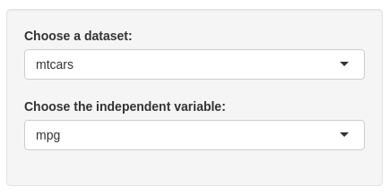

## Overview

This Shiny application is a tool for exploratory data analysis on a dataset. 
It's goal is to provide an immediate insight into the structure of a dataset, using a correlation matrix and a 3d plot to have a visual cue into the relationship the variables of the dataset have one with an other

--- #overview 

## Instructions

To use the app, you must choose a dataset, and then pick on the variables within that dataset to use through the analysis.

<div style="width:100%;text-align:center"></div>

Currently available datasets are: mtcars, pressure, rock

--- #selectfield 

## Correlation

The correlation matrix analyses the correlation of the chosen independent variable with all the other variables within the dataset.
In the example below we show the ouput after choosing the variable mpg (car consumption in Miles / gallon) from the dataset mtcars
```{r corr, echo=FALSE}
library(ggplot2, warn.conflicts = FALSE)
library(plotly, warn.conflicts = FALSE)
library(webshot)
tt_correlation_matrix <- function (dataset, independent_variable ) {
  #collects required data from the dataset
  orig_names <- colnames(dataset)
  n_cols <- dim(dataset)[2]
  cor_vector <- numeric( n_cols - 1 )
  
  #fetch the column with the independent variable
  y <- dataset[[independent_variable]]
  n <- 1
  #loop over all the columns, and calculate the correlation with the independent variable
  for ( i in 1:n_cols ) {
    if ( independent_variable != orig_names[i] && is.numeric(y) ) {
      cor_vector[n] <- cor(y , dataset[, i])
      names(cor_vector)[n] <- orig_names[i]
      n <- n + 1
    }
  }
  
  #sort by absolute value of correlation
  cor_vector <- cor_vector[order(abs(cor_vector), na.last = TRUE, decreasing = TRUE)] 
  #output
  cor_vector
}

cor <- tt_correlation_matrix(mtcars, "mpg")       
cor
```

--- #corr

## Plot
  
The app also automatically displays a 3d plot, plotting the chosen independent variable against the three most correlated parameters (on the x-axis, y-axis and through a color scheme), to provide immediate visual insight into the data structure.
Here is an example of the output with the dataset mtcars.

<div style="width:100%;text-align:center"></div>

```{r simple-plot, fig.height = 6, fig.align = 'center', message = F, echo=FALSE}
# cor <- tt_correlation_matrix(mtcars, "mpg")
# dataset <- mtcars
# independent_variable <- "mpg"
# 
# z_values = dataset[[independent_variable]]
#           x_values = dataset[[names(cor)[1]]]
#           y_values = dataset[[names(cor)[2]]]
#           colors = dataset[[names(cor)[3]]]
#           
#           p <- plot_ly(dataset, x = x_values, y = y_values, z = z_values, color = colors, colors = c('#BF382A', '#0C4B8E')) %>%
#             add_markers()  
#           # %>%
#           #   layout(scene = list(xaxis = list(title = "Weight (1,000lbs)"),
#           #                       yaxis = list(title = "Cylinders"),
#           #                       zaxis = list(title = "Miles (US) / gallon")),
#           #          annotations = list(
#           #            x = 1.13,
#           #            y = 1.05,
#           #            text = 'Displacement',
#           #            xref = 'paper',
#           #            yref = 'paper',
#           #            showarrow = FALSE
#           #          ))
# p
```