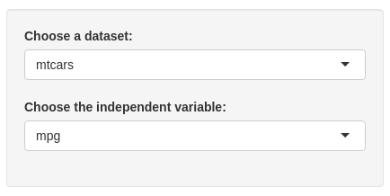
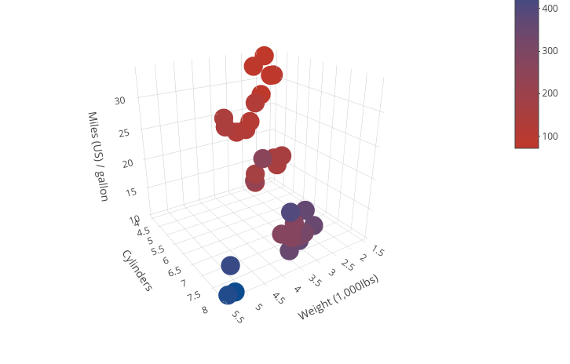

## Overview

This Shiny application is a tool for exploratory data analysis on a dataset. 
It's goal is to provide an immediate insight into the structure of a dataset, using a correlation matrix and a 3d plot to have a visual cue into the relationship the variables of the dataset have one with an other

--- #overview 

## Instructions

To use the app, you must choose a dataset, and then pick on the variables within that dataset to use through the analysis.

<div style="width:100%;text-align:center"></div>

Currently available datasets are: mtcars, pressure, rock

--- #selectfield 

## Correlation

The correlation matrix analyses the correlation of the chosen independent variable with all the other variables within the dataset.
In the example below we show the ouput after choosing the variable mpg (car consumption in Miles / gallon) from the dataset mtcars

```
##         wt        cyl       disp         hp       drat         vs         am 
## -0.8676594 -0.8521620 -0.8475514 -0.7761684  0.6811719  0.6640389  0.5998324 
##       carb       gear       qsec 
## -0.5509251  0.4802848  0.4186840
```

--- #corr

## Plot
  
The app also automatically displays a 3d plot, plotting the chosen independent variable against the three most correlated parameters (on the x-axis, y-axis and through a color scheme), to provide immediate visual insight into the data structure.
Here is an example of the output with the dataset mtcars.

<div style="width:100%;text-align:center"></div>


